# Flink

​	Apache Flink is a *framework*(框架) and *distributed*(分布式) processing engine for *stateful*(状态) computations over *unbounded*(无界) and *bounded data streams* [数据流上的有状态计算]

## Flink简介

#### 应用场景

* 电商和市场营销：实时报表、广告投放、实时推荐
* 物联网：实时数据采集、实时报警
* 物流配送及服务：订单状态追踪及服务
* 银行和金融业：实时结算、风险检测

#### 优势

* 流批一体
* 低延迟、高吞吐
* 结果准确性和良好容错性

#### Flink分层的API

1. SQL [最高层语言]
2. Table API [声明式领域专用语言] (类似DSL)
3. `DataStream` / DataSet(弃用边缘) API [核心API]
4. 有状态流处理 [底层API] `ProcessFunction`

#### Spark和Flink

| 对比     | Spark               | Flink                            |
| -------- | ------------------- | -------------------------------- |
| 架构设计 | Lambda              | Kappa                            |
| 底层设计 | 基于批处理设计      | 基于流处理设计                   |
| 数据模型 | RDD - 小数据量集合  | 数据流(DataStream)、事件序列     |
| 运行架构 | 批计算，以Stage划分 | 数据直接发送到相应的点，无需等待 |

## Flink入门案例

### Batch

```java
// 1.获取环境
ExecutionEnvironment env = ExecutionEnvironment.getExecutionEnvironment();

// 2.获取数据源、读取数据
DataSource<String> lineSource = env.readTextFile("input/words.txt");

// 3.通过lambda表达式，将lineSource转换成Tuple2格式然后收集起来，扁平映射出来
FlatMapOperator<String, Tuple2<String, Long>> tuple2Return = lineSource.flatMap(
    (String line, Collector<Tuple2<String, Long>> out) -> {
        String[] str = line.split(" ");
        for (String s : str) {
            out.collect(Tuple2.of(s, 1L));
        }
    }
).returns(Types.TUPLE(Types.STRING, Types.LONG));

// 4.通过Tuple中的 `0号元素(key)` 对 `1号元素(value)` 进行Sum聚合统计
AggregateOperator<Tuple2<String, Long>> sum = tuple2Return.groupBy(0).sum(1);

// 5.打印出结果
sum.print();
```

### Stream-Bounded

```java
// 1.获取环境 【readFile】
StreamExecutionEnvironment env = StreamExecutionEnvironment.getExecutionEnvironment();

// 2.获取数据源、读取数据
DataStreamSource<String> lineSource = env.readTextFile("input/");

// 3.通过lambda表达式，将lineSource转换成Tuple2格式然后收集起来，扁平映射出来
SingleOutputStreamOperator<Tuple2<String, Long>> tuple2Return = lineSource.flatMap(
    (String line, Collector<Tuple2<String, Long>> out) -> {
        String[] str = line.split(" ");
        for (String s : str) {
            out.collect(Tuple2.of(s, 1L));
        }
    }
).returns(Types.TUPLE(Types.STRING, Types.LONG));

// 4.通过Tuple中的 `0号元素(key)` 对 `1号元素(value)` 进行Sum聚合统计
SingleOutputStreamOperator<Tuple2<String, Long>> sum = tuple2Return.keyBy(data -> data.f0).sum(1);
// 5.打印出结果
sum.print();

env.execute();
```

### Stream-unBounded

```java
// 1.获取环境 【socket】
StreamExecutionEnvironment env = StreamExecutionEnvironment.getExecutionEnvironment();

// 2.获取数据源、读取数据
DataStreamSource<String> lineSource = env.socketTextStream("192.168.32.151", 11778);

// 3.通过lambda表达式，将lineSource转换成Tuple2格式然后收集起来，扁平映射出来
SingleOutputStreamOperator<Tuple2<String, Long>> tuple2Return = lineSource.flatMap(
    (String line, Collector<Tuple2<String, Long>> out) -> {
        String[] str = line.split(" ");
        for (String s : str) {
            out.collect(Tuple2.of(s, 1L));
        }
    }
).returns(Types.TUPLE(Types.STRING, Types.LONG));

// 4.通过Tuple中的 `0号元素(key)` 对 `1号元素(value)` 进行Sum聚合统计
SingleOutputStreamOperator<Tuple2<String, Long>> sum = tuple2Return.keyBy(data -> data.f0).sum(1);
// 5.打印出结果
sum.print();

env.execute();
```

## Flink环境搭建

### 上传资源，安装java11环境

> 上传 `flink-1.15.3-bin-scala_2.12.tgz` + `jdk-11.0.15.1_linux-x64_bin.tar.gz` 到 `/export/server` 目录下
>
> 安装 `Java11` 并解压 `Flink1.15.3` 
>
> 新建 flink 用户，修改 flink 用户的 `JAVA_HOME` 为Java11

### Standalone

修改配置文件中

```yaml
# 修改jobmanager的主节点在node1上
jobmanager.rpc.address: node1
# 绑定所有主机都可以访问本机
jobmanager.bind-host: 0.0.0.0

# 默认webui绑定在node1:8081上 【可注释】
rest.port: 8081
rest.bind-address: node1
```

```shell
# 启动集群
$FLINK_HOME/bin/start-cluster.sh

# 停止集群
$FLINK_HOME/bin/stop-cluster.sh
```

### 部署模式

#### Session

会话模式，特点是资源固定，不需要重复启动集群和资源，适用于`任务执行时间短，作业数量多`的场景 [standalone]

#### Per-Job

单任务模式，特点是每`一个集群只针对一个任务`进行运行，适用于任务执行时间长，作业数量少的场景 [yarn、k8s]

#### Application

应用模式，特点是每`一个集群只针对一个应用程序`进行运行，适用于任务执行时间长，作业数量少的场景 [yarn、k8s]

> other: `standalone在application部署中`，可以使用同样在bin目录下的standalone-job.sh来创建一个JobManager
>
> 1. 进入到Flink的安装路径下，`将应用程序的jar包放到lib/目录下`
>
> 	```shell
> 	cp ./FlinkTutorial-1.0-SNAPSHOT.jar lib/
> 	```
>
> 2. 启动JobManager
>
> 	```shell
> 	./bin/standalone-job.sh start --job-classname jarPath
> 	# 直接指定作业入口，脚本会直接扫描lib目录，所有的jar包
> 	```
>
> 3. 启动TaskManager
>
> 	```shell
> 	./bin/taskmanager.sh start
> 	```
>
> 4. 停止集群
>
> 	```shell
> 	./bin/standalone-job.sh stop
> 	./bin/taskmanager.sh stop
> 	```

### Yarn

#### Session mode

在Yarn集群中开启一个集群，开启Yarn会话

```shell
bin/yarn-session.sh -nm appName
```

| 参数                     | 备注                        |
| ------------------------ | --------------------------- |
| -d                       | 分离模式，后台运行          |
| -jm(--jobManagerMemory)  | 配置JobManager内存，默认MB  |
| -nm(--name)              | 配置YARN UI界面的任务名     |
| -qu(--queue)             | 指定YARN 队列名             |
| -tm(--taskManagerMemory) | 配置TaskManager内存，默认MB |

#### Per-Job mode

在Yarn集群中开启一个集群，用于提交一个单独的作业，启动Flink集群

```shell
# 现在的版本
bin/flink run -d -t yarn-per-job -c top.taurushu.wc.WordCount FlinkWordCount.jar

# 以前的版本 
bin/flink run -m yarn-cluster -c top.taurushu.wc.WordCount FlinkWordCount.jar
```

| 参数                   | 备注                                 |
| ---------------------- | ------------------------------------ |
| -d                     | 分离模式，后台运行                   |
| -t                     | 运行模式 "yarn-per-job" (deprecated) |
| -c,--class <classname> | 配置启动类名                         |

#### Application mode

在Yarn集群中开启一个集群，用于提交一个应用程序，启动Flink集群

```shell
# 开启集群，提交作业
bin/flink run-application -t yarn-application -c top.taurushu.wc.WordCount FlinkWordCount.jar
# 查看集群
bin/flink list -t yarn-application -Dyarn.application.id=application_xxxxxx_yy
# 取消作业
bin/flink canel -t yarn-application -Dyarn.application.id=application_xxxxxx_yy <jobId>
```

报错问题：

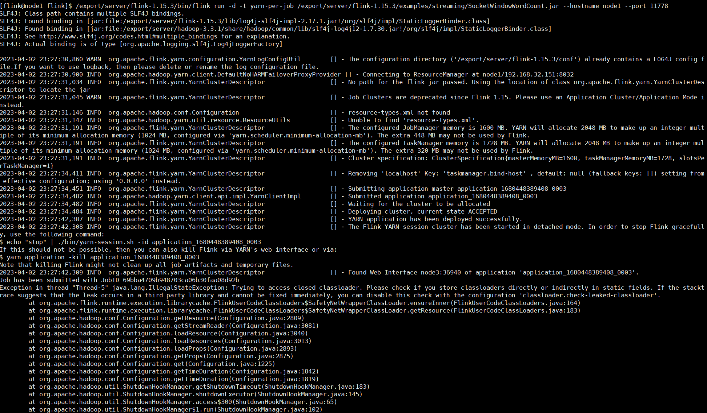

> Exception in thread "Thread-5" java.lang.IllegalStateException: Trying to access closed classloader. Please check if you store classloaders directly or indirectly in static fields. If the stacktrace suggests that the leak occurs in a third party library and cannot be fixed immediately, you can disable this check with the configuration 'classloader.check-leaked-classloader'.
> 
> 解决方案：在conf/flink-config.properties中配置classloader.check-leaked-classloader: false

## 系统架构

### Flink运行时架构

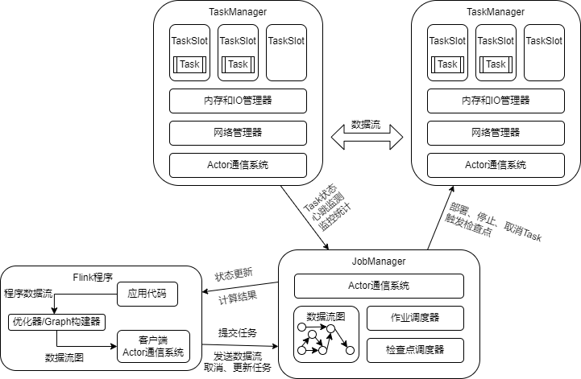

### 作业提交流程

#### job提交抽象流程

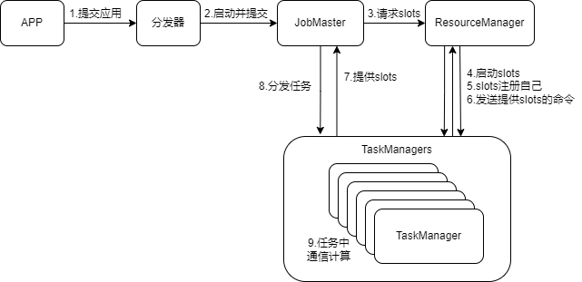

#### Standalone提交流程

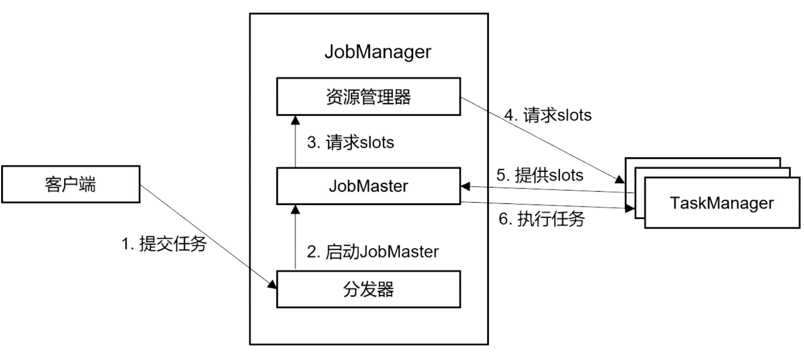

#### Yarn-session提交流程

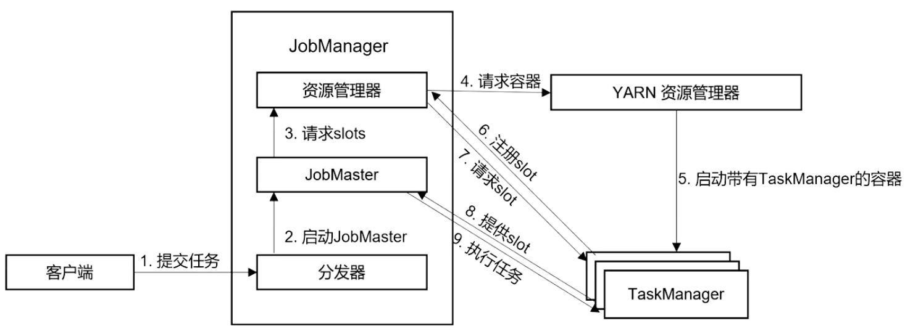

#### Yarn-Per-Job提交流程

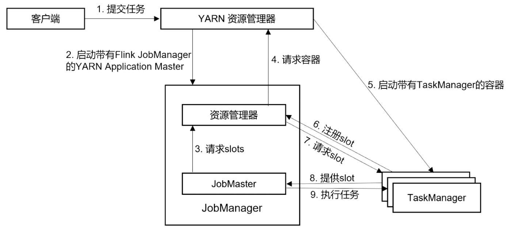

### 程序和数据流(DataFlow)

一个Flink程序可以看作三部分：source、transformation、sink

Flink程序在运行时，会被转换为逻辑数据流(DataFlows)包含了三部分，以一个或多个source开始，以一个或多个sink结束。

### 并行度(Parallelism)

并行度分为两部分：`数据并行度`和`任务并行度`

设置并行度的方式:

```java
// 1. flink-config.properties
// parallelism.default: 1

// 2. 命令行参数设置
// Parallelism=2

// 3. 代码环境设置
env.setParallelism(2)
    
// 4. 代码运行时添加算子并行度，优先级最高
Operator().setParallelism(2)
```

#### 数据传输形式

1. 一个程序中，会包含多个算子，不同的算子会存在不同的并行度
2. 算子间，数据可以是one-to-one(forwarding)，也可以是redistributing，取决于算子种类
	* one-to-one(forwarding)：意味着，两个算子之间维护的元素个数、顺序都相同，是一对一关系
	* redistributing：stream的分区发生改变，数据会依据逻辑，发送到不同的目标任务中去

#### 算子链

Flink的任务链优化技术，在并行度相同、one-to-one时对任务链进行合并操作，减少本地通信的开销，以本地转发(local forward)的方式进行连接

#### 执行图

Flink中的执行图分为四层：StreamGraph -> JobGraph -> ExecutionGraph -> 物理执行图

* StreamGraph: 依据代码逻辑API生成的图，用来表示程序的拓扑结构
* JobGraph: 优化后的StreamGraph，将要提交给JobManager的数据结构。主要将符合条件的节点chain在一起进行优化
* ExecutionGraph: JobManager生成的Graph，ExecutionGraph是JobGraph的并行化版本，是调度层最核心的数据结构
* 物理执行图: JobManager根据ExecutionGraph调度后，在TaskManagers上部署Task后的图，不是具体的数据结构

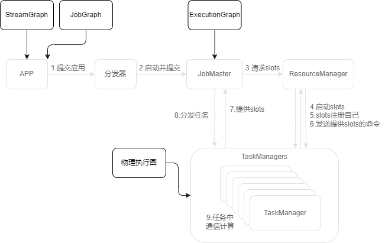

#### Task \ TaskSlots

在Flink中，一个TaskManager -> 一个JVM进程 -> n个TaskSlot -> m个Task任务 

##### 任务共享Slot

由于TaskSlot的资源相等，Task的负载不均，若一个Task占用一个TaskSlot，那么集群资源利用率则不高，所以Flink默认可以使不同的Task运行在同一个TaskSlot中，叫做任务共享Slot

这样可以使一个slot运行Job的整个管道，这样`资源密集型`和`非密集型`的任务同时放在一个slot中可以自行评分资源占用比例，平衡TaskManager的负载

1. Task Slot
	* 静态概念，TaskManager具有的并发执行能力
	* 通过参数taskmanager.numberOfTaskSlots进行配置
2. 并行度 (parallelism)
	* 动态概念，也就是TaskManager运行时实际的并发能力
	* 通过参数parallelism.default进行配置

设置并行度的三种常见方式：

1. flink-conf.yaml: - yaml

	```yaml
	parallelism.default: 2
	```

2. Flink 客户端 - shell

	```shell
	bin/flink run -p 2
	```

3. 代码执行环境 - java

	```java
	env.setParallelism(2)
	```

4. 算子执行单独修改 - java

	```java
	Operator().setParallelism(2)
	```

#### Other - 关闭优化

关闭默认优化 - chain

```java
// 关闭前后执行链优化
Operator().disableChaining();
env.disableChaining();

// 开启当前算子前后执行链优化
Operator().startNewChain();
env.startNewChain();
```

关闭默认优化 - sharing slot

```java
// 设置某算子的slot共享组
Operator().slotSharingGroup(String str)
// 1. 同组的算子，才可以共享slot
// 2. 调用了slotSharingGroup()后，该算子后面的所有算子都是该组
```

## DataStream Api

Flink的基本步骤

1. 获取执行环境(execution environment)
2. 读取数据源(source)
3. 定义基于数据的转换操作(transformations)
4. 定义计算结果的输出位置(sink)
5. 触发程序执行(execute)

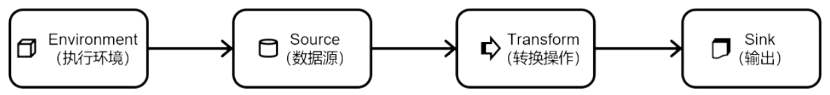

### 创建执行环境

1. 创建批式执行环境

	```java
	ExecutionEnvironment env =
	ExecutionEnvironment.getExecutionEnvironment()
	```

2. 创建流式执行环境

	```java
	// 自动根据上下文获取执行环境，本机执行则是本地，运行flink程序则是远程集群服务
	StreamExecutionEnvironment env =
	StreamExecutionEnvironment.getExecutionEnvironment()
	    
	// 创建本地执行环境
	StreamExecutionEnvironment localEnv =
	StreamExecutionEnvironment.createLocalEnvironment()
	    
	// 创建远程集群执行环境
	StreamExecutionEnvironment env =
	StreamExecutionEnvironment.createRemoteEnvironment(
	    hostname: "host",
	    port: 1234,
	    jar: "path/.jar"
	)
	```

3. 以流式Api运行批处理
	DataStream的三种执行模式

	* streaming: 

	* batch: 

	* automatic: 

	1. 以java代码指定（代码内置写死，不推荐）

	```java
	env.setRuntimeMode(RuntimeExecutionMode.BATCH);
	```

	2. 命令行提交代码时，进行配置

	```shell
	bin/flink run -Dexecution.runtime-mode=BATCH ...
	```

	> 虽然BATCH模式看起来似乎被Streaming全覆盖了
	>
	> 区别是BATCH运行时，数据全部处理完，才会一次性输出结果
	>
	> 但是Stream运行中，流式处理模式将会产生更多的中间结果输出
	>
	> 所以在本来输入有界、只希望通过批处理得到最终结果的场景下，Streaming模式下会不够高效

### DataSource

#### readTextFile / socketTextStream

```java
StreamExecutionEnvironment env = StreamExecutionEnvironment.getExecutionEnvironment();
// env.setParallelism(1);
DataStreamSource<String> textFile = env.readTextFile("input/UserEvent.log");
// DataStreamSource<String> socketTextStream = env.socketTextStream("node1", 17788);

// 封装处理逻辑
SingleOutputStreamOperator<Event> map = textFile
    .map(s -> new Event(s.split(",")[0], s.split(",")[1], Long.valueOf(s.split(",")[2])));

map.print();
env.execute();
```

#### KafkaSource

<1.15.3官网更新版本>

1. 导入flink连接kafka的依赖

	```xml
	<dependency>
	    <groupId>org.apache.flink</groupId>
	    <artifactId>flink-connector-kafka</artifactId>
	    <version>${flink.veresion}</version>
	</dependency>
	```

2. 配置kafkaSource，读取数据

	```java
	/* 读取kafka内容 */
	KafkaSource<String> source = KafkaSource.<String>builder()
	    .setBootstrapServers("node1:9092")
	    .setTopics("input-topic")
	    .setGroupId("my-group")
	    .setStartingOffsets(OffsetsInitializer.earliest())
	    .setValueOnlyDeserializer(new SimpleStringSchema())
	    .build();
	
	DataStreamSource<String> kafkaSource = 
	    env.fromSource(source, WatermarkStrategy.noWatermarks(), "Kafka Source");
	```

#### DIY Source


1. ParallelSourceFunction

	```java
	StreamExecutionEnvironment env = StreamExecutionEnvironment.getExecutionEnvironment();
	DataStreamSource<Event> source = env.addSource(new SourceFunction<Event>() {
	    private Boolean running = true;
	    @Override
	    public void run(SourceContext<Event> sourceContext) {
	        Random random = new Random();
	        String[] users = {"Mary", "Lily", "Bob", "Alix"};
	        String[] urls = {"./home", "./math", "./product?id=2232"};
	        while (running) {
	            sourceContext.collect(new Event(
	                users[random.nextInt(users.length)],
	                urls[random.nextInt(urls.length)],
	                new Date().getTime()
	            ));
	        }
	    }
	
	    @Override
	    public void cancel() {
	        running = false;
	    }
	});
	
	source.print();
	env.execute();
	```

2. ParallelSourceFunction

	```java
	StreamExecutionEnvironment env = StreamExecutionEnvironment.getExecutionEnvironment();
	env.setParallelism(4);
	// 修改class - SourceFunction 为 ParallelSourceFunction
	DataStreamSource<Event> source = env.addSource(new ParallelSourceFunction<Event>() {
			...
	
	    @Override
	    public void run(SourceContext<Event> sourceContext) {
			...
	    }
	
	    @Override
	    public void cancel() {
			...
	    }
	}).setParallelism(2); // 可以设置并行度，使其并行读取
	
	source.print();
	env.execute();
	```

### SingleOutputStreamOperator

#### BasicTransformation

##### Map

进行`映射`操作，常用于转换类型，或者获取到数据中需要的内容使用

> public <R> SingleOutputStreamOperator<R> map(MapFunction<T, R> mapper)

  ```java
  SingleOutputStreamOperator<Event> map = textFile.map(
      s -> new Event(s.split(",")[0], s.split(",")[1], Long.valueOf(s.split(",")[2]))
  ).returns(Types.POJO(Event.class));
  ```

##### Filter

进行过滤操作，返回true的元素正常输出，false元素会被拦截

> public SingleOutputStreamOperator<T> filter(FilterFunction<T> filter)

```java
map = map.filter(value -> !"Bob".equals(value.getName()));
```

##### FlatMap

进行`扁平映射`操作，返回列表内容中的所有元素

> public <R> SingleOutputStreamOperator<R> flatMap(FlatMapFunction<T, R> flatMapper)

```java
SingleOutputStreamOperator<String> map = wordTxt.flatMap(
    (String value, Collector<String> out) -> Arrays.stream(value.split(" ")).forEach(out::collect)
).returns(Types.STRING);
```

#### AggregationTransformation

##### keyBy & reduce

根据给定逻辑分别进行分组聚合，属于是通用逻辑，但是实现复杂

> public <K> KeyedStream<T, K> keyBy(KeySelector<T, K> key)
>
> & public SingleOutputStreamOperator<T> reduce(ReduceFunction<T> reducer)

```java
SingleOutputStreamOperator<Tuple2<String, Long>> tuple2KeyValue = source.flatMap(
    (String value, Collector<Tuple2<String, Long>> out) ->
    Arrays.stream(value.split(" ")).forEach(
        word -> out.collect(new Tuple2<>(word, 1L))
    )
).returns(Types.TUPLE(Types.STRING, Types.LONG));

KeyedStream<Tuple2<String, Long>, String> tuple2StringKeyedStream = tuple2KeyValue.keyBy(value -> value.f0);

SingleOutputStreamOperator<Tuple2<String, Long>> keyed = tuple2StringKeyedStream.reduce(
    (Tuple2<String, Long> v1, Tuple2<String, Long> v2) -> Tuple2.of(v1.f0, v1.f1 + v2.f1)
).returns(Types.TUPLE(Types.STRING, Types.LONG));

keyed.keyBy(value -> "default").reduce(
    (Tuple2<String, Long> red1, Tuple2<String, Long> red2) -> red1.f1 > red2.f1 ? red1 : red2
).returns(Types.TUPLE(Types.STRING, Types.LONG)).print();
env.execute();
```

##### keyBy & max/maxBy

通过KeyBy分组，求最大值，

max：会找出以max为最大值的max，其他数据为初始数据

maxBy：会找出以max为最大值的数据

> public SingleOutputStreamOperator<T> max(int positionToMax)
>
> & public SingleOutputStreamOperator<T> maxBy(int positionToMaxBy)

```java
// hadoop hadoop hadoop
// shujie shujie shujie shujie
keyed.keyBy(value -> "default").max(1).returns(Types.TUPLE(Types.STRING, Types.LONG)).print();
// hadoop 4

keyed.keyBy(value -> "default").maxBy(1).returns(Types.TUPLE(Types.STRING, Types.LONG)).print();
// shujie 4
```

#### RichFunction

富函数：提供比常规函数更多的，更丰富功能的类，可以获取到`运行环境的上下文`，拥有一些`生命周期方法`等，可以实现更丰富的功能。

#### 物理分区 <Physical Partitioning>

分区策略：

1. shuffle：以`随机策略`将若干数据，发送到所有的分区中去

	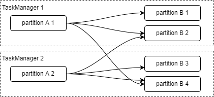

2. rebalance：以`轮询策略`将若干数据，发送到所有的分区中去

	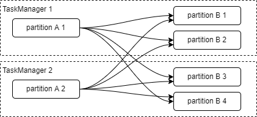

3. rescale：以`TaskManager内轮询策略`将若干数据，发送到当前的TaskManager的分区中去

	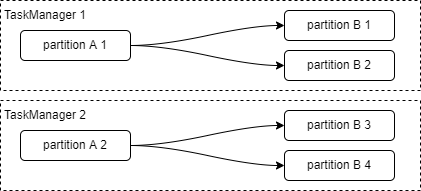

特殊分区：

1. broadcast：以`广播策略`将若干数据，发送到所有的分区中去

	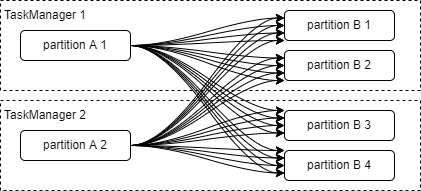

2. global：以`全局策略`将若干数据，发送到一个分区中去

	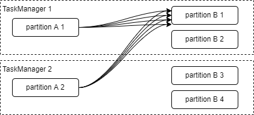

###  Sink

#### LocalFileSystemSink

```java
SingleOutputStreamOperator<String> returns = ... ;

StreamingFileSink<String> sink = StreamingFileSink.<String>forRowFormat(
    	new Path("src/main/resources/output"),		// 配置文件输出路径
    	new SimpleStringEncoder<>("UTF-8")			// 配置编码格式
)											// 返回sink,使用默认的滚动策略
    .withRollingPolicy(
    	DefaultRollingPolicy.builder()
	    .withMaxPartSize(MemorySize.ofMebiBytes(10L)) //缓存10Mbyts
	    .withRolloverInterval(Duration.ofSeconds(60)) // 60s生成一个新文件
	    .withInactivityInterval(Duration.ofSeconds(5)) // 如果无事件触发
	    .build()
	).build();

returns.addSink(sink); // sink
```

#### KafkaSink

```xml
<!-- flink 连接 kafka 的包 -->
<dependency>
    <groupId>org.apache.flink</groupId>
    <artifactId>flink-connector-kafka</artifactId>
    <version>${flink.veresion}</version>
</dependency>
```

```java
SingleOutputStreamOperator<String> returns = ... ;

KafkaSink<String> sink = KafkaSink.<String>builder()
    .setBootstrapServers("node1:9092")	// kafka集群地址
    .setRecordSerializer(
    	KafkaRecordSerializationSchema
    		.builder()
    		.setTopic("output-topic")	// kafka topic
    		.setValueSerializationSchema(new SimpleStringSchema())
    		.build()
	)
    .setDeliverGuarantee(DeliveryGuarantee.AT_LEAST_ONCE) 	// 设置至少消费一次
    .build();

returns.sinkTo(sink);
```

#### RedisSink

```xml
<!-- https://mvnrepository.com/artifact/org.apache.bahir/flink-connector-redis -->
<dependency>
    <groupId>org.apache.bahir</groupId>
    <artifactId>flink-connector-redis_2.11</artifactId>
    <version>1.1-SNAPSHOT</version>
</dependency>
```

```java
SingleOutputStreamOperator<Event> returns = ... ;

HashSet<InetSocketAddress> inetSocketAddressHashSet = new HashSet<>();
inetSocketAddressHashSet.add(new InetSocketAddress("node1", 7000));	// 节点1信息
inetSocketAddressHashSet.add(new InetSocketAddress("node2", 7000)); // 节点2信息
inetSocketAddressHashSet.add(new InetSocketAddress("node3", 7000)); // 节点3信息

source.addSink(new RedisSink<>(
    // 如果是分片集群的话使用集群模式的（FlinkJedisClusterConfig类）
    // 如果是哨兵集群的话使用哨兵模式的（FlinkJedisSentinelConfig类）
    // 如果是单点访问的话使用独立模式的（FlinkJedisPoolConfig类）
    new FlinkJedisClusterConfig.Builder().setNodes(inetSocketAddressHashSet).build(),
    new RedisMapper<Event>() {
        @Override
        public RedisCommandDescription getCommandDescription() {
            return new RedisCommandDescription(RedisCommand.HSET, "HASH_NAME", 3);
            // 编写redis配置信息，使用什么方式，过期事件，set方式等
        }

        @Override
        public String getKeyFromData(Event event) {	 // 从输入数据中获取key
            return event.getName();
        }

        @Override
        public String getValueFromData(Event event) {	// 从输入数据中获取value值
            return event.toString();
        }
    }
));
```

#### ElasticsearchSink

```xml
<!-- flink 连接 elasticsearch的包 -->
<dependency>
    <groupId>org.apache.flink</groupId>
    <artifactId>flink-connector-elasticsearch7</artifactId>
    <version>${flink.veresion}</version>
</dependency>
```

```java
// function
private static IndexRequest createIndexRequest(String element) {
    Map<String, Object> json = new HashMap<>();
    json.put("data", element);

    return Requests.indexRequest()
        .index("my-index")
        .id(element)
        .source(json);
}
```

```java
SingleOutputStreamOperator<String> returns = ... ;
returns.sinkTo(new Elasticsearch7SinkBuilder<String>()
               // 单条数据为单位插入数，缓存数量
               .setBulkFlushMaxActions(1) 
               // 设置es集群地址
               .setHosts(
                   new HttpHost("192.168.32.151", 9200, "http"),
                   new HttpHost("192.168.32.152", 9200, "http"),
                   new HttpHost("192.168.32.153", 9200, "http"))
               // 设置创建索引，以及元素的id，source等数据来源
               .setEmitter(
                   (element, context, indexer) -> indexer.add(createIndexRequest(element)))
               .build()
              );

env.execute();
```

#### MysqlSink

导入Flink jdbc连接，mysql驱动jar包

```xml
 <!-- flink 连接 jdbc的包 -->
<dependency>
    <groupId>org.apache.flink</groupId>
    <artifactId>flink-connector-jdbc</artifactId>
    <version>${flink.veresion}</version>
</dependency>
<dependency>
    <groupId>mysql</groupId>
    <artifactId>mysql-connector-java</artifactId>
    <version>5.1.47</version>
</dependency>
```

```java
DataStreamSource<Event> source = env.addSource(new DiyParallelSourceFunc()).setParallelism(2);


SinkFunction<Event> sink = JdbcSink.sink(
    "insert into events (name, uri, time) values (?, ?, ?)",                       // mandatory
    (PreparedStatement preparedStatement, Event event) -> {
        preparedStatement.setString(1, event.getName());
        preparedStatement.setString(2, event.getName());
        preparedStatement.setLong(3, event.getTime());
    },// mandatory
    JdbcExecutionOptions.builder()
    .withBatchIntervalMs(200)             // optional: default = 0, meaning no time-based execution is done
    .withBatchSize(1000)                  // optional: default = 5000 values
    .withMaxRetries(5)                    // optional: default = 3
    .build(),                  // optional
    new JdbcConnectionOptions.JdbcConnectionOptionsBuilder()
    .withUrl("jdbc:mysql://node1:3306/flinkSink?useSSL=false")
    .withUsername("root")
    .withPassword("shujie")
    .withDriverName("com.mysql.jdbc.Driver")
    .build()                  // mandatory
);

source.addSink(sink);
```

#### DiySink model

```java
package top.taurushu.streamSink;

import org.apache.flink.api.common.eventtime.Watermark;
import org.apache.flink.configuration.Configuration;
import org.apache.flink.streaming.api.datastream.DataStreamSource;
import org.apache.flink.streaming.api.environment.StreamExecutionEnvironment;
import org.apache.flink.streaming.api.functions.sink.RichSinkFunction;
import top.taurushu.streamSource.DiyParallelSourceFunc;
import top.taurushu.streamSource.Event;

public class WriteDiySink {
    public static void main(String[] args) throws Exception {
        StreamExecutionEnvironment env = StreamExecutionEnvironment.getExecutionEnvironment();

        DataStreamSource<Event> source = env.addSource(new DiyParallelSourceFunc()).setParallelism(2);


        source.addSink(new MySinkFunction());

        env.execute();
    }
}

class MySinkFunction extends RichSinkFunction<Event> {

    @Override
    public void open(Configuration parameters) throws Exception {
        super.open(parameters);
    }

    @Override
    public void invoke(Event value, Context context) throws Exception {
        super.invoke(value, context);
    }

    @Override
    public void writeWatermark(Watermark watermark) throws Exception {
        super.writeWatermark(watermark);
    }

    @Override
    public void finish() throws Exception {
        super.finish();
    }

    @Override
    public void close() throws Exception {
        super.close();
    }
}
```

## 时间/水印/窗口

### Time(时间)

1. 处理时间(Processing Time)
		处理时间，指执行处理操作的机器的`系统时间`。

2. 事件时间(Event Time)
		事件时间，指事件发生的时间，也就是`数据生成的时间`。是数据的属性，也就是这条数据记录的"时间戳 Timestamp"

	​	在事件时间语义下，我们对于时间的衡量，就不看任何机器的系统时间了，而是依赖于数据本身。由于分布式系统中网络`传输延迟`的不确定性，实际应用中我们要面对的数据流往往是`乱序`的。在这种情况下，就不能简单地把数据自带的时间戳当作时钟了，而需要用另外的标志来表示事件时间进展，在Flink中把它叫作事件时间的 "水位线 `Watermark`"

> Flink1.12版本后，默认的时间设置的是`事件时间Event Time`

### WaterMark(水位线/水印)

水位线的含义：在水位线之后，不会再出现水位线之前的时间(EventTime)，代表水位线时，数据已经到齐了

#### 乱序策略

使用`Flink内置策略 - forBoundedOutOfOrderness with TimestampAssigner`，

在代码中生成`乱序有界的根据给定时间的`水位线：

```java
DataStream<Event> source = ... ;

SingleOutputStreamOperator<Event> kfkSrcWithWM2 =
        source.assignTimestampsAndWatermarks(
                WatermarkStrategy
                        .<Event>forBoundedOutOfOrderness(Duration.ofMillis(120))
                        .withTimestampAssigner(
                                (SerializableTimestampAssigner<Event>)
                                        (element, recordTimestamp) -> element.getTime()
                        )
        );
```

#### 有序策略

使用`Flink内置策略 - forMonotonousTimestamps with TimestampAssigner`，

在代码中生成`单调时间`的水位线：

```java
DataStream<Event> source = ... ;

SingleOutputStreamOperator<Event> kfkSrcWithWM2 =
        source.assignTimestampsAndWatermarks(
                WatermarkStrategy
                        .<Event>forMonotonousTimestamps()  // 修改为单调的时间
                        .withTimestampAssigner(
                                (SerializableTimestampAssigner<Event>)
                                        (element, recordTimestamp) -> element.getTime()
                        )
        );
```

#### 自定义水位线策略

`基于事件`发送水印的

```java
(WatermarkStrategy<Event>) context -> new WatermarkGenerator<Event>() {
    @Override
    public void onEvent(Event event, long eventTimestamp, WatermarkOutput output) {
        output.emitWatermark(new Watermark(event.getTime()));
    }

    @Override
    public void onPeriodicEmit(WatermarkOutput output) {

    }
}
```

`基于周期`发送`允许迟到的`水印

```java
(WatermarkStrategy<Event>) context -> new WatermarkGenerator<Event>() {
    private long maxTimestamp;

    @Override
    public void onEvent(Event event, long eventTimestamp, WatermarkOutput output) {
        maxTimestamp = Math.max(maxTimestamp, event.getTime());
    }

    @Override
    public void onPeriodicEmit(WatermarkOutput output) {
        output.emitWatermark(new Watermark(maxTimestamp - 120 - 1));
    }
}
```

### Window(窗口)

#### 按照驱动类型划分


##### 1. TimeWindow 时间窗口

以事时间点来定义窗口的开始与结束，到达结束时间后，窗口不在收集数据

##### 2. CountWindow 计数窗口

以窗口的数据个数作为开始和结束，只需要限制窗口大小，就可以把数据分配到对应的窗口中

#### 按照窗口分配数据的规则分类

##### 1. 滚动窗口(Tumbling Window)

对应类 👉[`Tumbling[EventTime/ProcessingTime]Windows`](#TumblingWindows)

滚动窗口特点：窗口`大小固定`，将数据`均匀切片`，窗口间`没有重叠`，`一个`数据分配属于`一个`窗口

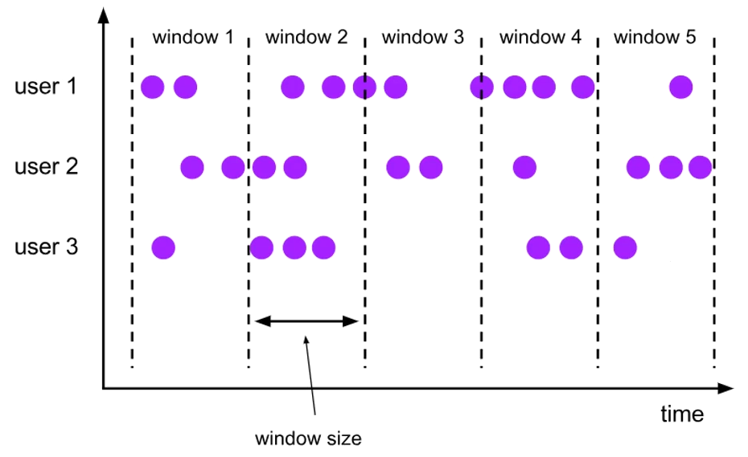

##### 2. 滑动窗口(Sliding Window)

对应类 👉[`Sliding[EventTime/ProcessingTime]Windows`](#SlidingWindows)

滑动窗口特点：窗口`大小固定`，窗口间`存在滑动步长`，窗口间`有`重叠部分，`一个`数据可能属于`多个`窗口


##### 3. 会话窗口(Session Window)

对应类[`[Processing/DynamicProcessing/DynamicEvent/Event]TimeSessionWindow`](#SessionWindow)

会话窗口：窗口大小`不固定`，按照会话`间隔大小`，进行分割窗口，窗口间有间隔且间隔`大于`设定的间隔大小

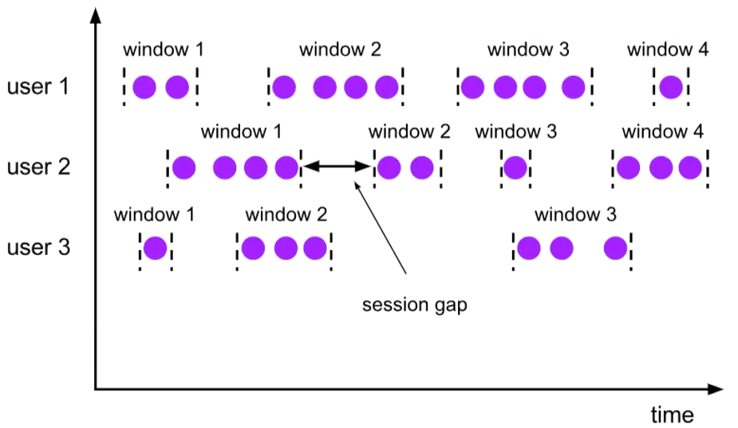

##### 4. 全局窗口(Global Window)

对应类[`GlobalWindows`]

全局窗口：把相同key的`所有数据`都分配到`一个窗口`中，默认不会触发计算，需要`自定义触发器`，进行计算处理

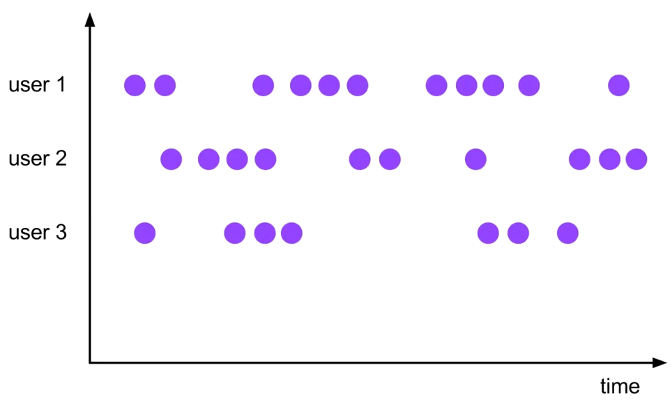

### 窗口分类

#### 按键分区 Keyed

基于keyBy后对`KeyedStream<T, K>`建立窗口

```java
stream.keyBy(element -> element.getKey()).window(WindowAssigner<?> assigner).xxx()
```

#### 按键分区 Non-Keyed

基于DataStream对`全部`数据建立窗口 [这样的话，全局并行度则是1，实际应用中不推荐使用]

```java
stream.windowAll(...).xxx()
```

### 窗口API

总的来说，一个窗口函数分为两个部分：1.窗口划分逻辑 [WindowAssigner] 2.窗口计算逻辑 [WindowFunction]

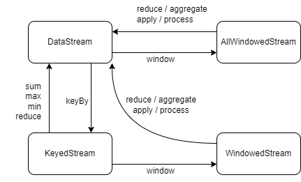

#### 窗口划分逻辑 [WindowAssigner]

定义窗口类型，窗口如何划分

1. <a name="TumblingWindows">滚动窗口 Tumbling[EventTime/ProcessingTime]Windows</a>

	```java
	// 需要传一个参数 - 滚动窗口的窗口大小
	stream.keyBy(key -> "default")
	    .window(TumblingEventTimeWindows.of(Time.milliseconds(1000)))
	    // 处理时间窗口/会话时间
		// .window(TumblingProcessingTimeWindows.of(Time.milliseconds(1000)))
	    .reduce((ReduceFunction<Long>) Long::sum)
	    .print();
	```

2. <a name="SlidingWindows">滑动窗口 Sliding[EventTime/ProcessingTime]Windows</a>

	```java
	// 需要传一个参数 - 划动窗口的窗口大小，以及窗口移动的步长 
	stream.keyBy(key -> "default")
	    .window(SlidingEventTimeWindows.of(Time.milliseconds(1000),Time.milliseconds(500)))
		// 处理时间窗口/会话时间
		// .window(SlidingProcessingTimeWindows.of(Time.milliseconds(1000),Time.milliseconds(500)))
	    .reduce((ReduceFunction<Long>) Long::sum)
	    .print();
	```

3. <a name="SessionWindow">会话窗口 [Processing/DynamicProcessing/DynamicEvent/Event]TimeSessionWindow</a>

4. `计数窗口 countWindow`

	```java
	// 需要传一个参数 - 计数窗口中每个窗口的元素数量
	stream.keyBy(key -> "default")
	    .countWindow(200)
	    .reduce((ReduceFunction<Long>) Long::sum)
	    .print();
	```

#### 窗口计算逻辑 [WindowedStream / WindowFunction]

典型的增量聚合函数有：ReduceFunction归约函数 / AggregateFunction

常见的有：min/minBy/max/maxBy/`aggregate`/apply(老版本，功能被process取代)/`process`/`reduce`

| 函数                                                         |                                                              |
| ------------------------------------------------------------ | ------------------------------------------------------------ |
| `reduce`(ReduceFunction(V, V))                               | 将两个元素，按照`自定义逻辑`处理，返回一个新的元素           |
| `aggregate`(AggregateFunction<IN,ACC,OUT>)                   | 根据传入的泛型，实现的四个函数，定义聚合函数                 |
| `aggregate`(AggregateFunction<IN,ACC,OUT>,<br/>ProcessWindowFunction<IN, OUT, KEY, W>) | 两个函数相配合使用，在aggregate函数中计算数据，在process函数发送数据 |
| `process`(ProcessWindowFunction<IN, OUT, KEY, W>)            | 根据传入泛型值在process函数中进行计算，发送数据              |

> * `reduce`:
> 	* ReduceFunction(V, V) -> V
> 		* V：迭代计算 value 类型，返回value相同类型，适用于相同数据间的迭代计算
> * `aggregate`：
>   * AggregateFunction<IN, ACC, OUT> -> OUT
>   	* IN：输入数据类型
>   	* ACC：累加器类型
>   	* OUT：输出数据类型
>   * 方法：
>   	* createAccumulate：初始化累加器
>   	* add：accumulator：迭代计算
>   	* getResult：获取返回值
>   	* merge：窗口数据合并 [`会话窗口`]
> * `process`：
> 	* ProcessWindowFunction<IN, OUT, KEY, W extends Window> -> OUT
> 		* IN：输入数据类型
> 		* OUT：输出数据类型
> 		* KEY：keyBy字段分组类型
> 		* W extends Window：设定窗口类型
> * `aggregate`(AggregateFunction<T, ACC, V> aggFunction, 
> 	         ProcessWindowFunction<V, R, K, W> windowFunction)
> 	* AggregateFunction<T, ACC, V> -> V
> 		* T：输入的数据类型
> 		* ACC：累加器类型
> 		* V：AggregateFunction的数据输出类型和ProcessWindowFunction的数据输入类型
> 	* ProcessWindowFunction<V, R, K, W> -> R
> 		* V：AggregateFunction的数据输出类型和ProcessWindowFunction的数据输入类型
> 		* R：返回数据的类型
> 		* K：keyBy字段类型
> 		* W：给定窗口类型

```java
package top.taurushu.window;

import org.apache.flink.api.common.eventtime.SerializableTimestampAssigner;
import org.apache.flink.api.common.eventtime.WatermarkStrategy;
import org.apache.flink.api.common.functions.AggregateFunction;
import org.apache.flink.streaming.api.datastream.SingleOutputStreamOperator;
import org.apache.flink.streaming.api.functions.windowing.ProcessWindowFunction;
import org.apache.flink.streaming.api.windowing.assigners.TumblingEventTimeWindows;
import org.apache.flink.streaming.api.windowing.time.Time;
import org.apache.flink.streaming.api.windowing.windows.TimeWindow;
import org.apache.flink.util.Collector;
import top.taurushu.pojo.Event;
import top.taurushu.utils.FromKafkaSource;

import java.sql.Timestamp;
import java.time.Duration;
import java.util.HashSet;
import java.util.function.Function;

public class ForAggregateFullWindowFunction {
    public static void main(String[] args) throws Exception {
        Function<SingleOutputStreamOperator<Event>, Void> function = (SingleOutputStreamOperator<Event> stream) -> {
            stream.assignTimestampsAndWatermarks(
                            WatermarkStrategy.<Event>forBoundedOutOfOrderness(Duration.ofMillis(120)).withTimestampAssigner(
                                    (SerializableTimestampAssigner<Event>) (element, recordTimestamp) -> element.getTime()
                            )
                    )
                    .keyBy(Event::getName)
                    .window(TumblingEventTimeWindows.of(Time.milliseconds(200)))
                    .aggregate(new CustomAggWinFunc(), new CustomProWinFunc())
                    .print();
            return null;
        };
        FromKafkaSource.executeFromKafkaSource(function);
    }

    static class CustomAggWinFunc implements AggregateFunction<Event, HashSet<String>, Long> {

        @Override
        public HashSet<String> createAccumulator() {
            return new HashSet<>();
        }

        @Override
        public HashSet<String> add(Event value, HashSet<String> accumulator) {
            accumulator.add(value.getName());
            return accumulator;
        }

        @Override
        public Long getResult(HashSet<String> accumulator) {
            return (long) accumulator.size();
        }

        @Override
        public HashSet<String> merge(HashSet<String> a, HashSet<String> b) {
            HashSet<String> set = new HashSet<>();
            set.addAll(a);
            set.addAll(b);
            return set;
        }
    }

    static class CustomProWinFunc extends ProcessWindowFunction<Long, String, String, TimeWindow> {
        @Override
        public void process(String s, ProcessWindowFunction<Long, String, String, TimeWindow>.Context context,
                            Iterable<Long> elements, Collector<String> out) {
            for (Long size : elements) {
                out.collect(new Timestamp(context.window().getStart())
                        + " ~ " + new Timestamp(context.window().getEnd())
                        + ": " + size);
                break;
            }
        }
    }
}
```

#### 其他API

##### Trigger 触发器

Trigger 触发器 控制窗口什么时候触发，设置定时服务，再窗口结束时间要做的动作

* onElement：每接受一个数据，触发一个行为
* onProcessingTime：定时处理，执行一个行为
* onEventTime：事件时间，执行一个行为

> TriggerResult枚举类，定义发送和清理动作

##### Evictor 移除器

Evictor 移除器 定义窗口数据的取舍

* evictBefore：定义运算之前的数据的取舍
* evictAfter：定义运算之后的数据的取舍

##### AllowedLateness 允许延迟

AllowedLateness 允许延迟 在window后调用allowedLateness，表示允许延迟

*  定义的(Time)Time.time，虽然定义期间，出现的数据不会进行计算了，但是在计算后还是能够添加到窗口之中，参与下一次的计算，允许延迟到达，让真正关闭窗口的时间，再晚一些

#### SideOutputLateData 侧输出流

SideOutputLateData 侧输出流 定义迟到的数据存储位置，还可以将他提取出来，基于窗口处理完成后的DataStream调用GetSideOutput()，传入对应标签获取迟到数据所在的侧输出流。

```java
OutputTag<Event> eventOutputTag = new OutputTag<Event>("eventLate");  // 定义侧输出流标签
DataStream<String> mainOutput = stream
    .assignTimestampsAndWatermarks(...)
    .keyBy(...)
    .window(...)
    .sideOutputLateData(eventOutputTag)  // 传进侧输出流的标签，获取数据
    .aggregate(AggFunction,ProcessFunction);
operator.getSideOutput(eventOutputTag).print("outside");  // 从运算结果中返回测数据流数据，并打印
operator.print("main"); 
```

### 总结

数据允许迟到的三种手段

1. WaterMark：会严重导致计算延迟，通常设置 < 1000ms
2. allowLateness：允许数据迟到，但是窗口不关闭，资源不能释放，通常设置 1min
3. sideOutputStream：将严重迟到的数据再整合到一起

## 处理函数

基本处理函数ProcessFunction

基本可以获取到所有的数据：

* 获取窗口对象
* 获取水印位置
* 获取事件时间
* 注册定时服务
* 实现了富函数类

### 如何获取

```java
DataStream stream = ... ;
stream.process(ProcessFunction<T, R> processFunction [, TypeInformation<R> outputType])
```

> public \<R\> SingleOutputStreamOperator\<R\> process(
>         ProcessFunction<T, R> processFunction, TypeInformation\<R\> outputType)

ProcessFunction

* processElement(IN, ProcessFunction<IN, OUT>.Context, Collector\<OUT\> )
  * Context: 获取到上下文对象
  	* public abstract Long timestamp()：获取到当前事件时间戳
  	* public abstract TimerService timerService()：定时器服务
  	  * long currentProcessingTime()：当前的处理时间
  	  * long currentWatermark()：当前水印
  	  * void registerProcessingTimeTimer(long time)：keyedStream才能使用，注册处理时间定时器
  	  	* 注册定时器之后需要去实现[onTimer](#onTimer)方法
  	  * void registerEventTimeTimer(long time)：keyedStream才能使用，注册事件时间定时器
  	  	* 注 册定时器之后需要去实现[onTimer](#onTimer)方法
  	  * void deleteProcessingTimeTimer(long time)：删除处理时间定时器
  	  * void deleteEventTimeTimer(long time)：删除事件时间定时器
  	* public abstract \<X\> void output(OutputTag\<X\> outputTag, X value)：发送到侧输出流
* getRuntimeContext：
  * 任务：获取Jobid、获取Task名、最大子任务数
  * 子任务：获取子任务索引、获取子任务的任务名、获取分区中子任务的数量、获取指标组
  * 工具：[建立/获得]累加器、[初始化获得/获得]广播变量、获取分布式缓存、获取双精度浮点计数器、获取长整数计数器、获取整数计数器、
  * 状态：获取聚合状态、获取归约状态、获取尝试次数AttemptNumber、获取状态、获取列表状态、获取Map状态、是否有广播变量
  * 对象：运行配置对象、获取外部资源信息、获取直方图、获取用户代码类加载器、如歌不存在则实例化钩子函数并注册用户代码类加载器
* <a name="onTimer">onTimer</a>：
	* long timestamp: 当前时间戳
	* OnTimerContext ctc：定时器上下文 = 定时器内容 + 上下文
	* Output out：数据收集器


### 案例：每秒输出当前最火的页面

```java
/* top.taurushu.pojo.Event */
package top.taurushu.pojo;

import lombok.Data;

import java.sql.Timestamp;

@Data
public class Event {

    private String name;
    private String uri;
    private Long time;

    public Event() {
    }

    public Event(String value) {
        this(value.split(",")[0], value.split(",")[1], Long.valueOf(value.split(",")[2]));
    }

    public Event(String name, String uri, Long time) {
        this.name = name;
        this.uri = uri;
        this.time = time;
    }
    
    @Override
    public String toString() {
        return "Event{" +
                "name='" + name + '\'' +
                ", uri='" + uri + '\'' +
                ", time=" + new Timestamp(time) +
                '}';
    }

}
```

```java
/* top.taurushu.utils.FromKafkaSource; */
package top.taurushu.utils;

import org.apache.flink.api.common.eventtime.WatermarkStrategy;
import org.apache.flink.api.common.functions.MapFunction;
import org.apache.flink.api.common.serialization.SimpleStringSchema;
import org.apache.flink.connector.kafka.source.KafkaSource;
import org.apache.flink.connector.kafka.source.enumerator.initializer.OffsetsInitializer;
import org.apache.flink.streaming.api.datastream.SingleOutputStreamOperator;
import org.apache.flink.streaming.api.environment.StreamExecutionEnvironment;
import top.taurushu.pojo.Event;

import java.util.function.Function;

public class FromKafkaSource {
    private FromKafkaSource() {

    }

    public static void executeFromKafkaSource(Function<SingleOutputStreamOperator<Event>, Void> function) throws Exception {
        StreamExecutionEnvironment env = StreamExecutionEnvironment.getExecutionEnvironment();
        KafkaSource<String> source = KafkaSource.<String>builder()
                .setBootstrapServers("node1:9092")
                .setTopics("flink-generate-topic")
                .setGroupId("my-group")
                .setStartingOffsets(OffsetsInitializer.earliest())
                .setValueOnlyDeserializer(new SimpleStringSchema())
                .build();
        SingleOutputStreamOperator<Event> kafkaSource = env.fromSource(source, WatermarkStrategy.noWatermarks(), "kafka Source")
                .map((MapFunction<String, Event>) Event::new).setParallelism(6);
        function.apply(kafkaSource);
        env.execute();
    }
}

```

```java
/* top.taurushu.pojo.UrlCount */
package top.taurushu.pojo;

import lombok.Data;

@Data
public class UrlCount {
    private String url;
    private Long count;
    private Long windowStart;
    private Long windowEnd;

    public UrlCount(){

    }

    public UrlCount(String url, Long count, Long windowStart, Long windowEnd) {
        this.url = url;
        this.count = count;
        this.windowStart = windowStart;
        this.windowEnd = windowEnd;
    }

    @Override
    public String toString() {
        return "UrlCount{" +
                "url='" + url + '\'' +
                ", count=" + count +
                ", windowStart=" + windowStart +
                ", windowEnd=" + windowEnd +
                '}';
    }
}
```

```java
/* top.taurushu.demo.ImplDemo1 */
package top.taurushu.demo;

import org.apache.flink.api.common.eventtime.SerializableTimestampAssigner;
import org.apache.flink.api.common.eventtime.WatermarkStrategy;
import org.apache.flink.api.common.functions.AggregateFunction;
import org.apache.flink.api.common.state.ListState;
import org.apache.flink.api.common.state.ListStateDescriptor;
import org.apache.flink.api.common.typeinfo.Types;
import org.apache.flink.configuration.Configuration;
import org.apache.flink.streaming.api.datastream.DataStream;
import org.apache.flink.streaming.api.datastream.SingleOutputStreamOperator;
import org.apache.flink.streaming.api.functions.KeyedProcessFunction;
import org.apache.flink.streaming.api.functions.windowing.ProcessWindowFunction;
import org.apache.flink.streaming.api.windowing.assigners.SlidingEventTimeWindows;
import org.apache.flink.streaming.api.windowing.time.Time;
import org.apache.flink.streaming.api.windowing.windows.TimeWindow;
import org.apache.flink.util.Collector;
import top.taurushu.pojo.Event;
import top.taurushu.pojo.UrlCount;
import top.taurushu.utils.FromKafkaSource;

import java.sql.Timestamp;
import java.time.Duration;
import java.util.ArrayList;
import java.util.function.Function;

public class ImplDemo1 {
    public static void main(String[] args) throws Exception {
        Function<SingleOutputStreamOperator<Event>, Void> function = (SingleOutputStreamOperator<Event> stream) -> {


            DataStream<UrlCount> aggregated = stream.assignTimestampsAndWatermarks(
                            WatermarkStrategy.<Event>forBoundedOutOfOrderness(Duration.ofMillis(50)).withTimestampAssigner(
                                    (SerializableTimestampAssigner<Event>) (element, recordTimestamp) -> element.getTime()
                            ))
                    .keyBy(Event::getUri)
                    .window(SlidingEventTimeWindows.of(Time.milliseconds(4000), Time.milliseconds(2000)))
                    .aggregate(new AggregateFunction<Event, UrlCount, UrlCount>() {
                                   @Override
                                   public UrlCount createAccumulator() {
                                       UrlCount urlCount = new UrlCount();
                                       urlCount.setUrl("");
                                       urlCount.setCount(0L);
                                       urlCount.setWindowStart(Long.MIN_VALUE);
                                       urlCount.setWindowEnd(Long.MIN_VALUE);
                                       return urlCount;
                                   }

                                   @Override
                                   public UrlCount add(Event value, UrlCount accumulator) {
                                       accumulator.setUrl(value.getUri());
                                       accumulator.setCount(accumulator.getCount() + 1L);
                                       return accumulator;
                                   }

                                   @Override
                                   public UrlCount getResult(UrlCount accumulator) {
                                       return accumulator;
                                   }

                                   @Override
                                   public UrlCount merge(UrlCount a, UrlCount b) {
                                       UrlCount urlCount = new UrlCount();
                                       urlCount.setUrl(a.getUrl());
                                       urlCount.setCount(a.getCount() + b.getCount());
                                       urlCount.setWindowStart(Math.min(a.getWindowStart(), b.getWindowStart()));
                                       urlCount.setWindowEnd(Math.max(a.getWindowEnd(), b.getWindowEnd()));
                                       return urlCount;
                                   }
                               },
                            new ProcessWindowFunction<UrlCount, UrlCount, String, TimeWindow>() {
                                @Override
                                public void process(String s, ProcessWindowFunction<UrlCount, UrlCount, String, TimeWindow>.Context context, Iterable<UrlCount> elements, Collector<UrlCount> out) throws Exception {
                                    for (UrlCount element : elements) {
                                        element.setWindowStart(context.window().getStart());
                                        element.setWindowEnd(context.window().getEnd());
                                        out.collect(element);
                                        break;
                                    }

                                }
                            }
                    );
//            aggregated.print("urlCount");

            aggregated.keyBy(UrlCount::getWindowEnd)
                    .process(new TopNProcessResult(3)).print("----------------------------");

            return null;
        };
        FromKafkaSource.executeFromKafkaSource(function);
    }

    public static class TopNProcessResult extends KeyedProcessFunction<Long, UrlCount, String> {

        private Integer n;
        private ListState<UrlCount> listState;


        public TopNProcessResult() {
        }

        public TopNProcessResult(Integer n) {
            this.n = n;
        }

        public Integer getN() {
            return n;
        }

        public void setN(Integer n) {
            this.n = n;
        }

        public static void getView(ArrayList<UrlCount> elements, int number, Collector<String> out,
                                   KeyedProcessFunction<Long, UrlCount, String>.Context ctx) {
            StringBuilder builder = new StringBuilder();
            builder.append("-----------------------------------------------\n");
            builder.append("窗口结束时间: ")
                    .append(new Timestamp(ctx.getCurrentKey()))
                    .append('\n');
            for (int i = 0; i < Math.min(number, elements.size()); i++) {
                UrlCount element = elements.get(i);
                builder.append("No.").append(i + 1)
                        .append("\turl:'").append(element.getUrl())
                        .append("'\t访问量:").append(element.getCount());
                builder.append('\n');
            }

            builder.append("-----------------------------------------------\n");
            out.collect(builder.toString());
        }

        @Override
        public void open(Configuration parameters) throws Exception {
            super.open(parameters);

            listState = getRuntimeContext()
                    .getListState(new ListStateDescriptor<UrlCount>("urlCountList", Types.POJO(UrlCount.class)));
        }

        @Override
        public void onTimer(long timestamp, KeyedProcessFunction<Long, UrlCount, String>.OnTimerContext ctx, Collector<String> out) throws Exception {
            ArrayList<UrlCount> urlCounts = new ArrayList<>();
            listState.get().forEach(urlCounts::add);
            urlCounts.sort((o1, o2) -> (int) (o2.getCount() - o1.getCount()));
            getView(urlCounts, 3, out, ctx);
        }

        @Override
        public void processElement(UrlCount value, KeyedProcessFunction<Long, UrlCount, String>.Context ctx, Collector<String> out) throws Exception {
            listState.add(value);
            ctx.timerService().registerEventTimeTimer(value.getWindowEnd() + 1L);
        }
    }
}
```

```java
/* top.taurushu.demo.ImplDemo2 */
package top.taurushu.demo;

import org.apache.flink.api.common.eventtime.WatermarkStrategy;
import org.apache.flink.api.common.functions.AggregateFunction;
import org.apache.flink.api.java.tuple.Tuple2;
import org.apache.flink.streaming.api.datastream.SingleOutputStreamOperator;
import org.apache.flink.streaming.api.functions.windowing.ProcessAllWindowFunction;
import org.apache.flink.streaming.api.windowing.assigners.SlidingEventTimeWindows;
import org.apache.flink.streaming.api.windowing.time.Time;
import org.apache.flink.streaming.api.windowing.windows.TimeWindow;
import org.apache.flink.util.Collector;
import top.taurushu.pojo.Event;
import top.taurushu.utils.FromKafkaSource;

import java.sql.Timestamp;
import java.time.Duration;
import java.util.ArrayList;
import java.util.HashMap;
import java.util.List;
import java.util.Map;
import java.util.function.Function;

public class ImplDemo2 {
    public static void main(String[] args) throws Exception {
        Function<SingleOutputStreamOperator<Event>, Void> function = (SingleOutputStreamOperator<Event> stream) -> {
            stream.assignTimestampsAndWatermarks(
                            WatermarkStrategy
                                    .<Event>forBoundedOutOfOrderness(Duration.ofMillis(50))
                                    .withTimestampAssigner((Event element, long recordTimestamp) ->
                                            element.getTime()
                                    )
                    )
                    .map(Event::getUri)

                    .windowAll(SlidingEventTimeWindows.of(Time.milliseconds(1000), Time.milliseconds(500)))
                    .aggregate(new AggregateFunction<String, Map<String, Long>, List<Tuple2<String, Long>>>() {
                        @Override
                        public Map<String, Long> createAccumulator() {
                            return new HashMap<>();
                        }

                        @Override
                        public Map<String, Long> add(String value, Map<String, Long> accumulator) {
                            if (accumulator.containsKey(value)) {
                                accumulator.put(value, accumulator.get(value) + 1L);
                            } else {
                                accumulator.put(value, 1L);
                            }
                            return accumulator;
                        }

                        @Override
                        public List<Tuple2<String, Long>> getResult(Map<String, Long> accumulator) {
                            List<Map.Entry<String, Long>> list = new ArrayList<>(accumulator.entrySet());
                            list.sort((o1, o2) -> (int) (o2.getValue() - o1.getValue()));

                            ArrayList<Tuple2<String, Long>> returnList = new ArrayList<>();
                            for (int i = 0; i < 3; i++) {
                                if (list.size() > i) {
                                    returnList.add(Tuple2.of(list.get(i).getKey(), list.get(i).getValue()));
                                }
                            }
                            return returnList;
                        }

                        @Override
                        public Map<String, Long> merge(Map<String, Long> a, Map<String, Long> b) {
                            HashMap<String, Long> map = new HashMap<>();
                            map.putAll(a);
                            map.putAll(b);
                            return map;
                        }
                    }
                    , new ProcessAllWindowFunction<List<Tuple2<String, Long>>, String, TimeWindow>() {
                        @Override
                        public void process(ProcessAllWindowFunction<List<Tuple2<String, Long>>, String, TimeWindow>.Context context,
                                            Iterable<List<Tuple2<String, Long>>> elements,
                                            Collector<String> out) throws Exception {
                            StringBuilder builder = new StringBuilder();
                            builder.append("-----------------------------------------------\n");
                            for (List<Tuple2<String, Long>> element : elements) {
                                builder.append("窗口结束时间: ")
                                        .append(new Timestamp(context.window().getEnd()))
                                        .append('\n');
                                for (int i = 0; i < element.size(); i++) {
                                    Tuple2<String, Long> tuple2 = element.get(i);
                                    builder.append("No.").append(i + 1)
                                            .append("\turl:'").append(tuple2.f0)
                                            .append("'\t访问量:").append(tuple2.f1);
                                    builder.append('\n');
                                }
                                break;
                            }
                            builder.append("-----------------------------------------------\n");
                            out.collect(builder.toString());
                        }
                    }
                    ).print();


            return null;
        };


        FromKafkaSource.executeFromKafkaSource(function);
    }
}
```

## 多流操作

### 1 -> N 分流操作

```java
public static void main(String[] args) throws Exception {
    Function<SingleOutputStreamOperator<Event>, Void> function = (SingleOutputStreamOperator<Event> stream) -> {

        stream = stream.assignTimestampsAndWatermarks(
            WatermarkStrategy.<Event>forBoundedOutOfOrderness(
                Duration.ofMillis(50)
            ).withTimestampAssigner((element, recordTimestamp) -> element.getTime())
        ).returns(Types.POJO(Event.class));
        OutputTag<Event> outMarry = new OutputTag<Event>("outMary", Types.POJO(Event.class));
        OutputTag<Event> outBob = new OutputTag<Event>("outBob", Types.POJO(Event.class));
        SingleOutputStreamOperator<Event> process = stream.process(new ProcessFunction<Event, Event>() {
            @Override
            public void processElement(Event value, ProcessFunction<Event, Event>.Context ctx,
                                       Collector<Event> out) throws Exception {
                if (Objects.equals(value.getName().substring(0, 4), "Mary")) {
                    ctx.output(outMarry, value);
                } else if (Objects.equals(value.getName().substring(0, 3), "Bob")) {
                    ctx.output(outBob, value);
                } else {
                    out.collect(value);
                }
            }
        }).returns(Types.POJO(Event.class));
        process.getSideOutput(outMarry).print("outMarry");
        process.getSideOutput(outBob).print("outBob");
        process.print("outElse");
        return null;
    };
    FromKafkaSource.executeFromKafkaSource(function);
}
```

### N -> 1 合流操作

#### Union 联合流

```java
SingleOutputStreamOperator<Event> source1 = ... ;
SingleOutputStreamOperator<Event> source2 = ... ;

source1.<Event>union(source2).map((Event e) -> 1).keyBy(l -> 1).sum(0).print();
```

#### Connect 连接流

```java
StreamExecutionEnvironment env = StreamExecutionEnvironment.getExecutionEnvironment();
DataStreamSource<Integer> ints = env.fromElements(1, 2, 3);
DataStreamSource<Long> longs = env.fromElements(1L, 2L, 3L);

ints.connect(longs).map(new CoMapFunction<Integer, Long, String>() {
    @Override
    public String map1(Integer value) throws Exception {
        return value.toString();
    }

    @Override
    public String map2(Long value) throws Exception {
        return value.toString();
    }
}).print();
env.execute();
```

#### boarodcastjoin 广播连接流

涉及状态知识 👉[boarodcastjoin](#boarodcastjoin)

#### 对账案例<状态>

```java
package top.taurushu.union;

import org.apache.flink.api.common.eventtime.WatermarkStrategy;
import org.apache.flink.api.common.state.ValueState;
import org.apache.flink.api.common.state.ValueStateDescriptor;
import org.apache.flink.api.scala.typeutils.Types;
import org.apache.flink.configuration.Configuration;
import org.apache.flink.streaming.api.datastream.SingleOutputStreamOperator;
import org.apache.flink.streaming.api.environment.StreamExecutionEnvironment;
import org.apache.flink.streaming.api.functions.co.CoProcessFunction;
import org.apache.flink.util.Collector;
import top.taurushu.pojo.Pay;
import top.taurushu.pojo.ThirdPayPlatform;

import java.time.Duration;
import java.util.Objects;

public class ElseConnectStream {
    public static void main(String[] args) throws Exception {
        StreamExecutionEnvironment env = StreamExecutionEnvironment.getExecutionEnvironment();


        SingleOutputStreamOperator<Pay> paySource = env.fromElements(
            new Pay("order_01", "app", 1000L),
            new Pay("order_02", "app", 1200L),
            new Pay("order_03", "app", 1300L),
            new Pay("order_04", "app", 1400L),
            new Pay("order_05", "app", 1500L)
        ).assignTimestampsAndWatermarks(WatermarkStrategy.<Pay>forBoundedOutOfOrderness(Duration.ofMillis(100))
                                        .withTimestampAssigner((element, recordTimestamp) -> element.getTimestampLong()));


        SingleOutputStreamOperator<ThirdPayPlatform> thirdSource = env.fromElements(
            new ThirdPayPlatform("order_01", "ThirdPayPlatform", true, 1000L - 100L),
            new ThirdPayPlatform("order_02", "ThirdPayPlatform", true, 1200L - 100L),
            new ThirdPayPlatform("order_03", "ThirdPayPlatform", true, 1300L - 100L),
            new ThirdPayPlatform("order_04", "ThirdPayPlatform", true, 1400L - 100L),
            new ThirdPayPlatform("order_05", "ThirdPayPlatform", true, 1500L - 100L)
        ).assignTimestampsAndWatermarks(WatermarkStrategy.<ThirdPayPlatform>forBoundedOutOfOrderness(Duration.ofMillis(100))
                                        .withTimestampAssigner((element, recordTimestamp) -> element.getTime()));


        paySource.connect(thirdSource)
            .keyBy(Pay::getOrderId, ThirdPayPlatform::getOrderId)
            .process(new CoProcessFunction<Pay, ThirdPayPlatform, String>() {
                ValueState<Pay> payValueState;
                ValueState<ThirdPayPlatform> platformValueState;

                @Override
                public void open(Configuration parameters) throws Exception {
                    payValueState = getRuntimeContext().getState(
                        new ValueStateDescriptor<>("pay-event", Types.POJO(Pay.class))
                    );
                    platformValueState = getRuntimeContext().getState(
                        new ValueStateDescriptor<>("third-event", Types.POJO(ThirdPayPlatform.class))
                    );
                }

                @Override
                public void processElement1(Pay value, CoProcessFunction<Pay, ThirdPayPlatform, String>.Context ctx, Collector<String> out) throws Exception {
                    if (Objects.isNull(platformValueState.value())) {
                        payValueState.update(value);
                        ctx.timerService().registerEventTimeTimer(value.getTimestampLong() + 5000L);
                    } else {
                        out.collect("对账成功\t" + value.toString() + "\t" + platformValueState.value());
                        platformValueState.clear();
                    }
                }

                @Override
                public void processElement2(ThirdPayPlatform value, CoProcessFunction<Pay, ThirdPayPlatform, String>.Context ctx, Collector<String> out) throws Exception {
                    if (Objects.isNull(payValueState.value())) {
                        platformValueState.update(value);
                        ctx.timerService().registerEventTimeTimer(value.getTime() + 5000L);
                    } else {
                        out.collect("对账成功\t" + payValueState.value() + "\t" + value.toString());
                        payValueState.clear();
                    }
                }


                @Override
                public void onTimer(long timestamp, CoProcessFunction<Pay, ThirdPayPlatform, String>.OnTimerContext ctx, Collector<String> out) throws Exception {
                    if (!Objects.isNull(payValueState)) {
                        out.collect("对账失败\t" + payValueState.value() + "\t" + "NUll");
                    }
                    if (!Objects.isNull(platformValueState)) {
                        out.collect("对账失败\t" + "NUll" + "\t" + platformValueState.value());
                    }
                    payValueState.clear();
                    platformValueState.clear();
                }
            }).print();

        env.execute();
    }
}

```

#### join 窗口连接

```java
public static void main(String[] args) throws Exception {
    StreamExecutionEnvironment env = StreamExecutionEnvironment.getExecutionEnvironment();

    SingleOutputStreamOperator<Pay> paySource = env.fromElements(
        new Pay("order_01", "app", 1000L),
        new Pay("order_02", "app", 1200L),
        new Pay("order_03", "app", 1300L),
        new Pay("order_04", "app", 1400L),
        new Pay("order_05", "app", 1500L)
    ).assignTimestampsAndWatermarks(WatermarkStrategy.<Pay>forBoundedOutOfOrderness(Duration.ofMillis(100))
                                    .withTimestampAssigner((element, recordTimestamp) -> element.getTimestampLong()));


    SingleOutputStreamOperator<ThirdPayPlatform> thirdSource = env.fromElements(
        new ThirdPayPlatform("order_01", "ThirdPayPlatform", true, 1000L - 100L),
        new ThirdPayPlatform("order_02", "ThirdPayPlatform", true, 1200L - 100L),
        new ThirdPayPlatform("order_03", "ThirdPayPlatform", true, 1300L - 100L),
        new ThirdPayPlatform("order_04", "ThirdPayPlatform", true, 1400L - 100L),
        new ThirdPayPlatform("order_05", "ThirdPayPlatform", true, 1500L - 100L)
    ).assignTimestampsAndWatermarks(WatermarkStrategy.<ThirdPayPlatform>forBoundedOutOfOrderness(Duration.ofMillis(100))
                                    .withTimestampAssigner((element, recordTimestamp) -> element.getTime()));

    paySource.join(thirdSource)
        .where(Pay::getOrderId).equalTo(ThirdPayPlatform::getOrderId)
        .window(SlidingEventTimeWindows.of(Time.milliseconds(200), Time.milliseconds(100)))
        .apply((Pay first, ThirdPayPlatform second) -> first + " -> " + second)
        .print();
    env.execute();
}
```

#### intervalJoin 间隔连接

```java
public static void main(String[] args) throws Exception {
    StreamExecutionEnvironment env = StreamExecutionEnvironment.getExecutionEnvironment();

    SingleOutputStreamOperator<Pay> paySource = env.fromElements(
        new Pay("order_01", "app", 1000L),
        new Pay("order_02", "app", 1200L),
        new Pay("order_03", "app", 1300L),
        new Pay("order_04", "app", 1400L),
        new Pay("order_05", "app", 1500L)
    ).assignTimestampsAndWatermarks(WatermarkStrategy.<Pay>forBoundedOutOfOrderness(Duration.ofMillis(100))
                                    .withTimestampAssigner((element, recordTimestamp) -> element.getTimestampLong()));


    SingleOutputStreamOperator<ThirdPayPlatform> thirdSource = env.fromElements(
        new ThirdPayPlatform("order_01", "ThirdPayPlatform", true, 1000L - 100L),
        new ThirdPayPlatform("order_02", "ThirdPayPlatform", true, 1200L - 100L),
        new ThirdPayPlatform("order_03", "ThirdPayPlatform", true, 1300L - 100L),
        new ThirdPayPlatform("order_04", "ThirdPayPlatform", true, 1400L - 100L),
        new ThirdPayPlatform("order_05", "ThirdPayPlatform", true, 1500L - 100L)
    ).assignTimestampsAndWatermarks(WatermarkStrategy.<ThirdPayPlatform>forBoundedOutOfOrderness(Duration.ofMillis(100))
                                    .withTimestampAssigner((element, recordTimestamp) -> element.getTime()));

    paySource.keyBy(Pay::getOrderId).intervalJoin(thirdSource.keyBy(ThirdPayPlatform::getOrderId))
        .between(Time.milliseconds(-250), Time.milliseconds(250))
        .process(new ProcessJoinFunction<Pay, ThirdPayPlatform, String>() {
            @Override
            public void processElement(Pay left, ThirdPayPlatform right, ProcessJoinFunction<Pay, ThirdPayPlatform, String>.Context ctx, Collector<String> out) throws Exception {
                out.collect(left + " -> " + right);
            }
        })
        .print();
    env.execute();
}
```

#### coGroup 组合窗口连接

```java
public class ConWindowJoin {
    public static void main(String[] args) throws Exception {
        StreamExecutionEnvironment env = StreamExecutionEnvironment.getExecutionEnvironment();

        SingleOutputStreamOperator<Pay> paySource = env.fromElements(
            new Pay("order_01", "app", 1000L), //  900L  750~1000   1000~1500
            new Pay("order_02", "app", 1200L), // 1100L
            new Pay("order_03", "app", 1300L), // 1200L
            new Pay("order_04", "app", 1400L), // 1300L
            new Pay("order_05", "app", 1500L)  // 1400L
        ).assignTimestampsAndWatermarks(WatermarkStrategy.<Pay>forBoundedOutOfOrderness(Duration.ofMillis(100))
                                        .withTimestampAssigner((element, recordTimestamp) -> element.getTimestampLong()));


        SingleOutputStreamOperator<ThirdPayPlatform> thirdSource = env.fromElements(
            new ThirdPayPlatform("order_01", "ThirdPayPlatform", true, 1000L - 100L),
            new ThirdPayPlatform("order_02", "ThirdPayPlatform", true, 1200L - 100L),
            new ThirdPayPlatform("order_03", "ThirdPayPlatform", true, 1300L - 100L),
            new ThirdPayPlatform("order_04", "ThirdPayPlatform", true, 1400L - 100L),
            new ThirdPayPlatform("order_05", "ThirdPayPlatform", true, 1500L - 100L)
        ).assignTimestampsAndWatermarks(WatermarkStrategy.<ThirdPayPlatform>forBoundedOutOfOrderness(Duration.ofMillis(100))
                                        .withTimestampAssigner((element, recordTimestamp) -> element.getTime()));


        paySource.keyBy(Pay::getOrderId).coGroup(thirdSource.keyBy(ThirdPayPlatform::getOrderId))
            .where(Pay::getOrderId, Types.STRING).equalTo(ThirdPayPlatform::getOrderId, Types.STRING)
            .window(SlidingEventTimeWindows.of(Time.milliseconds(500), Time.milliseconds(250)))
            .apply(new CoGroupFunction<Pay, ThirdPayPlatform, String>() {
                @Override
                public void coGroup(Iterable<Pay> first, Iterable<ThirdPayPlatform> second, Collector<String> out) throws Exception {
                    out.collect(first + "->" + second);
                }
            })
            .print();
        env.execute();
    }
}
```

## 状态编程

Flink种的状态分为`keyed State` 和 `Operator State` 还有广播状态`BroadcastState`

### keyed State 按键分区状态

内置的状态分为5种，分别是

1. ValueState 值状态

	```java
	getRuntimeContext().getState();
	
	public interface ValueState<T> extends State {
	    // 获取当前状态值
	    T value() throws IOException;
	    
	    // 更新、覆写状态值
	    void update(T value) throws IOException;
	```

2. ListState 列表状态

	```java
	getRuntimeContext().getListState();
	
	public interface ListState<T> extends MergingState<T, Iterable<T>> {
	
		// 传入一个列表values，直接对状态进行覆盖
	    void update(List<T> values) throws Exception;
	
	    // 向列表中添加多个元素，以列表values形式传入
	    void addAll(List<T> values) throws Exception;
	    
	    
	    /* AppendingState */
	    // 获取当前的列表状态，返回的是一个可迭代类型Iterable<T>
	    Iterable get() throws Exception; 
	
		// 在状态列表中添加一个元素value
	    void add(IN value) throws Exception;
	```

3. Map State 映射状态

	```java
	public interface MapState<UK, UV> extends State {
	    
		// 传入一个个key作为参数，查询对应的value值
	    UV get(UK key) throws Exception;
	    
		// 传入一个键值对，更新key对应的value值
	    void put(UK key, UV value) throws Exception;
	    
	    // 传入映射map中所有的键值对，全部添加到映射状态中
	    void putAll(Map<UK, UV> map) throws Exception;
	
		// 删除指定key
	    void remove(UK key) throws Exception;
	
	    // 判断是否存在指定的key,返回一个boolean值
	    boolean contains(UK key) throws Exception;
	
	    // 获取映射状态中所有的键值对
	    Iterable<Map.Entry<UK, UV>> entries() throws Exception;
	
	    // 获取映射状态中所有的键(key),返回一个可迭代Iterable类型
	    Iterable<UK> keys() throws Exception;
	
	    // 获取映射状态中所有的值(value),返回一个可迭代Iterable类型
	    Iterable<UV> values() throws Exception;
	
	    // 获取映射状态中所有的键值对
	    Iterator<Map.Entry<UK, UV>> iterator() throws Exception;
	
	    boolean isEmpty() throws Exception;
	}
	```

4. ReducingState

	```java
	// 状态中保存的是结果，并不是所有的值，结果是由初始结果与所有的值，按照逻辑迭代而来
	// 继承了ReduceFunction的特点 (V, V) -> V
	public ReducingStateDescriptor ( String name, ReduceFunction<T> reduceFunction, Class<T> typeClass) {}
	/*
	类似于值状态(Value)，不过需要对添加进来的所有数据进行归约，将归约聚合之后的值作为状态保存下来。ReducintState<T>这 个接口调用的方法类似于ListState， 只不过它保存的只是一个聚合值，所以调用.add(方法时，不是在状态列表里添加元素，而是直接把新数据和之前的状态进行归约，并用得到的结果更新状态
	*/
	```

5. AggregatingState

	```java
	// 状态中保存的是结果，并不是所有的值，结果是由初始结果与所有的值，按照逻辑迭代而来
	// 继承了AggregatingState的特点有通用的逻辑
	
	/* 
	AggregatingState()与归约状态非常类似，聚合状态也是一个值，用来保存添加进来的所有数据的聚合结果。与ReducingState 不同的是，它的聚合逻辑是由在描述器中传入一个更加一般化的聚合函数(AggregateFunction)来定义的;这也就是之前我们讲过的AggregateFunction， 里面通过一个累加器(Accumulator)来表示状态，所以聚合的状态类型可以跟添加进来的数据类型完全不同，使用更加灵活。
	*/
	```

### Operator State 算子状态


### <a name="boarodcastjoin">BroadcastState 广播状态</a>


 
